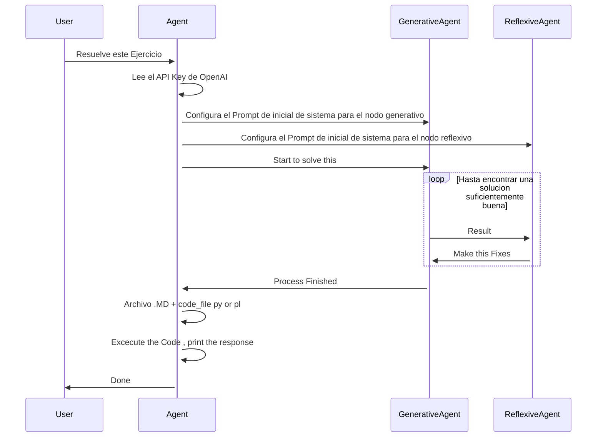

```mermaid
sequenceDiagram
    User ->>+ Agent: Resuelve este Ejercicio
    Agent ->>+ Agent: Lee el API Key de OpenAI
    Agent ->> GenerativeAgent: Configura el Prompt de inicial de sistema para el nodo generativo
    Agent ->> ReflexiveAgent : Configura el Prompt de inicial de sistema para el nodo reflexivo
    Agent ->> GenerativeAgent: Start to solve this

    loop Hasta encontrar una solucion suficientemente buena
    GenerativeAgent ->>+ ReflexiveAgent: Result
    ReflexiveAgent ->>+ GenerativeAgent: Make this Fixes
    end

    GenerativeAgent ->> Agent : Process Finished
    Agent ->> Agent: Archivo .MD + code_file py or pl
    Agent ->> Agent: Excecute the Code , print the response
    Agent ->> User : Done
```